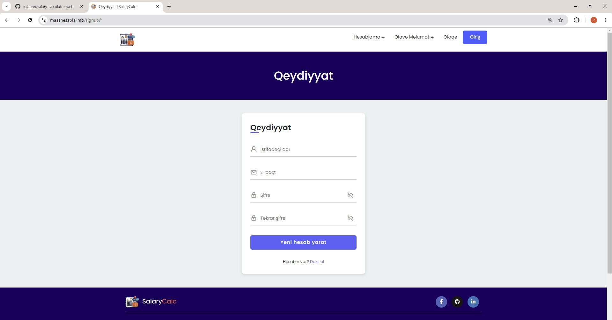
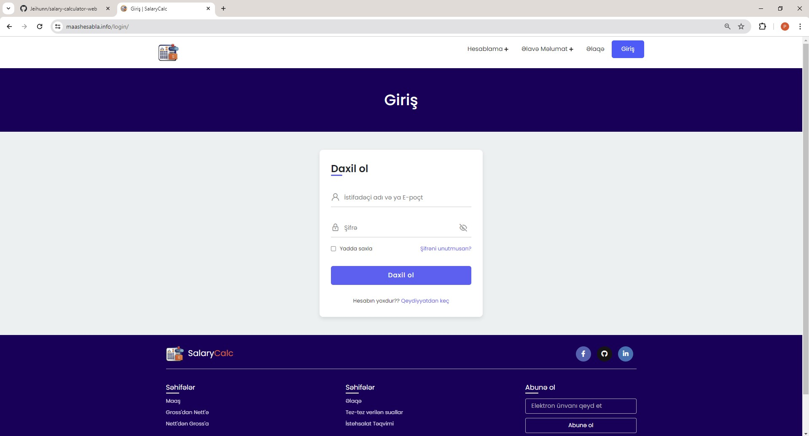
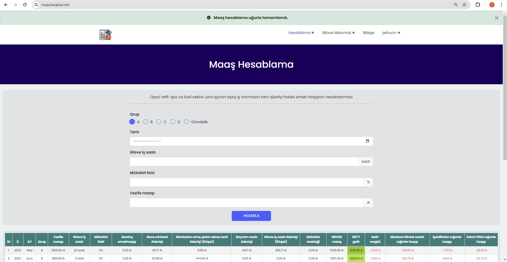
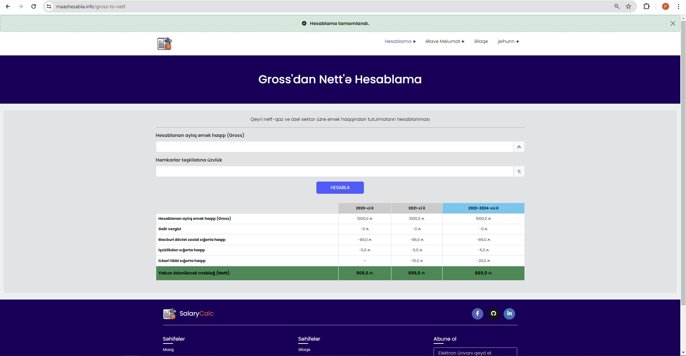
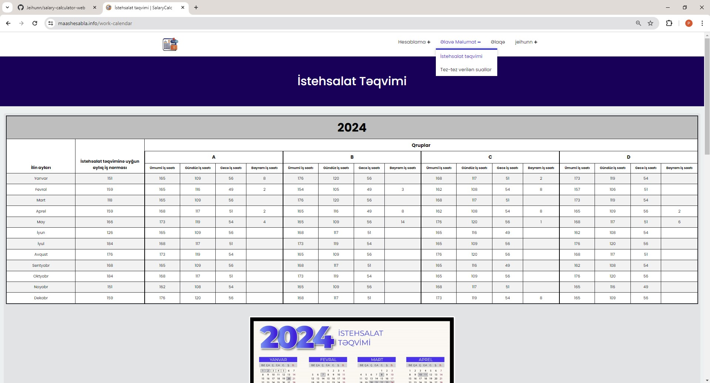
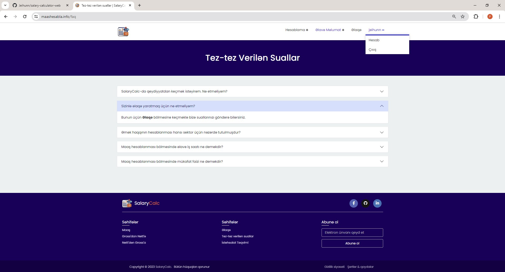
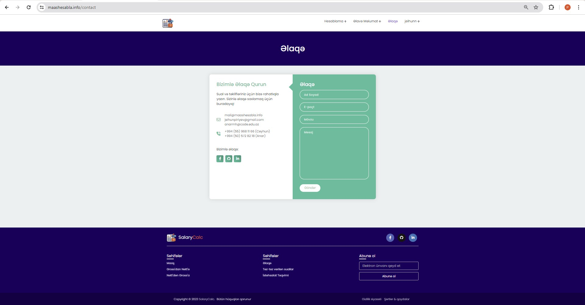

# 🚀 Salary Calculator Web Project

This project is a web application that allows users to calculate their estimated salaries for a specific calendar month. Users can calculate their salaries based on job categories, working hours, and other parameters.

## 🛠 Technologies

The project is developed using the following technologies:

- **Frontend:**
  - HTML
  - CSS
  - Bootstrap
  - JavaScript
- **Backend:**
  - Python
  - Django

## 🔧 Installation

To run the project on your local machine, follow these steps:

1. **Clone the repository to your local machine:**

    ```bash
    git clone https://github.com/Jeihunn/salary-calculator-web.git
    ```

2. **Navigate to the project directory:**

    ```bash
    cd salary-calculator-web
    cd SalaryCalc
    ```

3. **Create and activate a virtual environment (optional):**

    - **Windows:**

        ```bash
        python -m venv .venv
        .venv\Scripts\activate
        ```

    - **Mac and Linux:**

        ```bash
        python3 -m venv .venv
        source .venv/bin/activate
        ```

4. **Install the required Python packages:**

    ```bash
    pip install -r requirements.txt
    ```

5. **Run Django migrations:**

    ```bash
    python manage.py makemigrations
    python manage.py migrate
    ```

6. **Start the web server:**

    ```bash
    python manage.py runserver
    ```

7. **View the application in your browser:**

    You can view the application by going to `http://127.0.0.1:8000/`.

## 📝 Usage

1. To utilize all features of the website, first create a user account.
2. On the homepage, users fill out a form with necessary information (e.g., job category, working month, salary, etc.).
3. After clicking the Calculate button, users can view their estimated salaries.
4. Users can refill the form to recalculate if desired.

## 🌟 Contributors

Contributors to this project:

- [Jeihunn](https://github.com/Jeihunn)
- [Anar](https://github.com/anarmh)

## 📷 Screenshots

Below are the screenshots illustrating the functionality and user interface of the application.

1. Signup:

   

2. Login:

   

3. Monthly Salary Calculation:

   

4. Gross to Nett:

   

5. Work Calendar:

   

6. Frequently Asked Questions (FAQ):

   

7. Contact:

   
